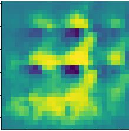
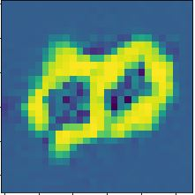

# | MGAN |
## A second year undergrad student's attempt to implement a GAN using the EMNIST dataset and a lot of spare time

I promised myself I'd do a project a week, and this is one of those projects. As of 05/24 the state of the returned images from the gan look like this (this is the one that looks most like a digit):

  

But hopefully with a bit more tweaking they may end up looking like something that resembles a digit.

Well it didn't end up working out. I couldnt tweak the GAN to create meaningful digits in time for my weekly deadline (work and life need to be balanced and all that)

Hopefully next weeks project will be more successful. It doesnt require PHD level maths and stats understanding to code.

In the end I'm happy that this was done as it was, and I'll be leaving it to train for a few hours to get some final results. See you on next weeks project! 

  

